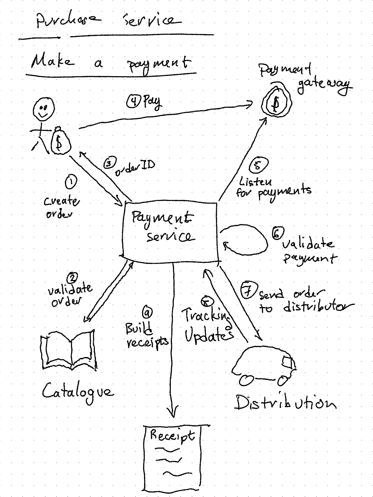

# A Simple Purchase Engine

This is a package I am building for practice between contracts. The goal is to make a simple, flexible, and correct purchasing system that can be used with any combination of payment gateway, distribution service, product catalogue.

A secondary goal is to demonstrate how executable specifications can be developed and run against either a package, backend service, or UI. The specifications are written in Gherkin and located in the features directory. Implementations for the test are located in `purchase_test.go` and `main_test.go`. These can be run with the `go test .` command or `godog`.

## Rough idea of how it works:

> Note: the customer holding the money bag is essential to this process!
